<!-- README.md is generated from README.Rmd. Please edit that file -->

# fargepalett

<!-- badges: start -->
<!-- badges: end -->

Målet med denne pakken er å gjøre det enkelt å bruke PwC sin fargepalett
i visualiseringer laget med ggplot eller andre figurer. Hovedfunksjonene
i pakken er “scale\_fill\_pwc” og “scale\_color\_pwc” som brukes for å
bestemme fargepaletten som brukes i hhv fill- og color-dimensjonen i
“aesthetic”. Både hex-kodene til fargene som lagt inn og alle foreslåtte
paletter ligger vedlagt som data-sett i pakken slik at en kan bruke
fargene i situasjoner hvor hovedfunksjonene ikke er tilstrekkelig. (Per
nå må dette akksesseres ved hhv fargepalett:::pwc\_colors og
fargepalett:::pwc\_palettes)

Fargekodene og de foreslåtte palettene er hentet fra presentasjonen
“PwCs farger og fargesammensetting”.

## Installering

I første omgang vil pakken være tilgjengelig på et åpent repo, men på
sikt må det vurderes om pakken må flyttes til et pwc-repo.

Pakken kan installeres fra github:

``` r
remotes::install_github("markusmortensen/fargepalett")
```

## Bruk av pakken

Under følger noen enkle eksempler på hvordan pakken kan brukes for å
bruke PwC-fargene i figurer.

``` r
library(ggridges)
theme_set(theme_bw())
```

``` r
iris %>% 
  ggplot(aes(x = Sepal.Length, y = Species, fill = Species)) + 
  geom_density_ridges() + 
  scale_fill_pwc()
```

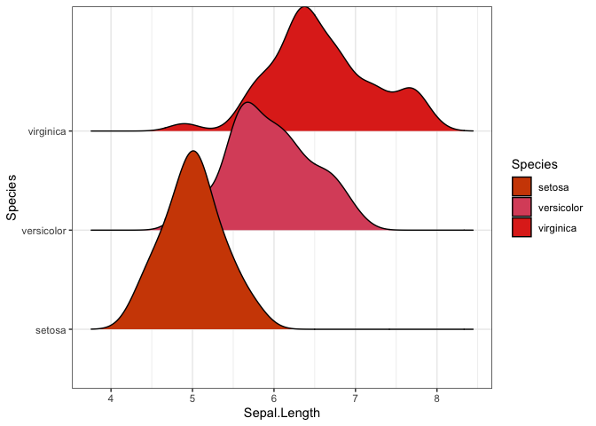

Eller 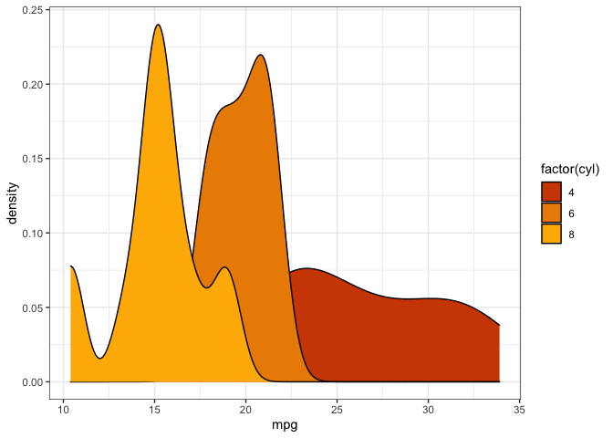

Figuren under viser at pwc-paletten desverre ikke er optimal for alle
figurer enda. Etter hvert vil det legges til flere paletter som passer
bedre for figurer som denne.

``` r
diamonds %>% 
  ggplot(aes(carat, price, color = cut)) + 
  geom_point() + 
  scale_color_pwc()
```

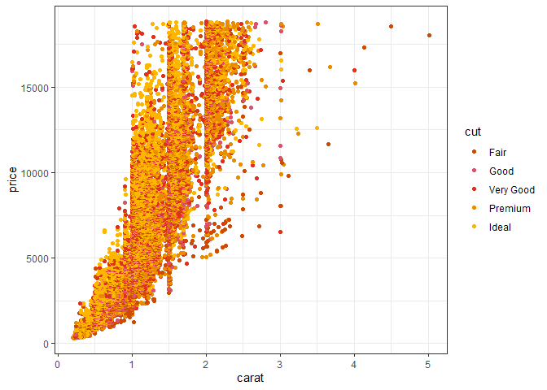

## Fremtidig arbeid

> “PwC-fargene er vel og bra, men det meste vi produserer er jo for
> kunder og bør følge deres fargepalett!”
>
> <footer>
> — Anonym associate
> </footer>

“Anonym associate” har et godt poeng. En stor andel av de
visualiseringene vi lager er for kunde, og ofte er det mer passende å
bruke deres fargepalett. I nær fremtid vil det derfor komme en vignett
for hvordan akkurat du kan legge til fargepaletten til kunden du jobber
med slik at du kan imponere med dine ggplot-skills uten styret med å
legge inn hex-koder manuelt.

På sikt håper jeg at denne pakken vil inneholde fargekodene til de
fleste kundene vi jobber med, slik at det er enkelt for neste person som
skal jobbe på prosjekt for en av disse kundene. I mellomtiden kan linken
under være et godt utgangspunkt for å finne farger som passer kunden
bedre.

<https://color.adobe.com/create/color-wheel/>

I tillegg står følgende punkter på todo-listen. Her setter jeg stor pris
på tips og pull-requests fra de som ønsker å bidra!

-   Sørge for at scale-funksjonen oppdager selv om variabelen krever
    kontinuerlig skala eller ikke.
-   Utvide med flere paletter fra følgende presentasjon:
    “201901\_Graphic\_Elements\_GLOBAL\_4.3”
    (<https://docs.google.com/presentation/d/1nyDO1_M-S7PggSTxPpW28jX8mLvZZurejDEfzKJ9bUM/edit#slide=id.p3>)
-   Rydde i palettene som eksisterer, passe på at fargene er i naturlig
    rekkefølge.
-   Lage vignett/funksjonalitet for å vise frem alle paletter/farger.
-   Legge inn brukervennlige feilmeldinger når farge/palett er
    feilstavet eller ikke eksisterer.
-   Forbedre dokumentasjon av datasett og funksjoner.
-   Skrive tester der det er nødvendig.

## Farger og paletter

### PwC standard palette

``` r
standard <- pwc_pal("pwc_palette", for_print = TRUE)
standard
```


### PwC standard palette reordered

``` r
standard_reorder <- pwc_pal("pwc_palette2", for_print = TRUE)
standard_reorder
```

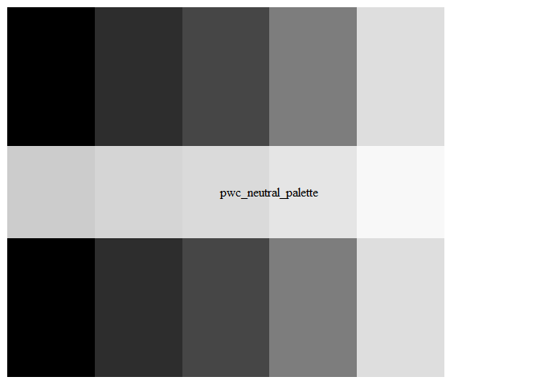

### PwC standard palette reordered og utvidet

``` r
standard_reorder_exp <- pwc_pal("pwc_palette2_expanded", for_print = TRUE)
standard_reorder_exp
```

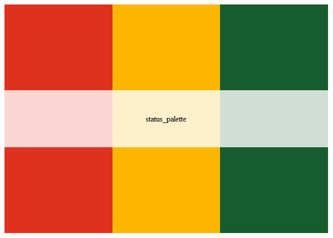

### PwC nøytral palette

``` r
neutral <- pwc_pal("pwc_neutral_palette", for_print = TRUE)
neutral
```

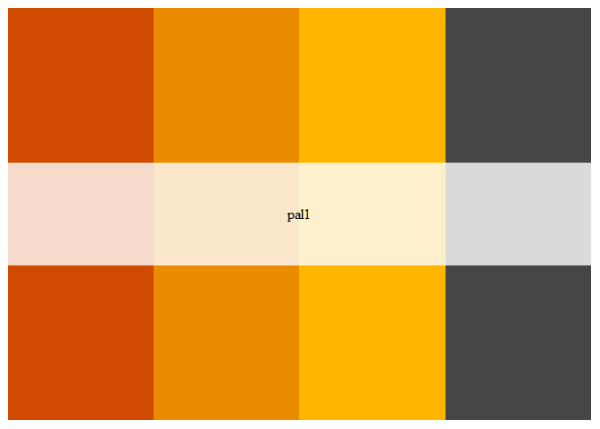

### PwC Status palette

``` r
status <- pwc_pal("status_palette", for_print = TRUE)
status
```

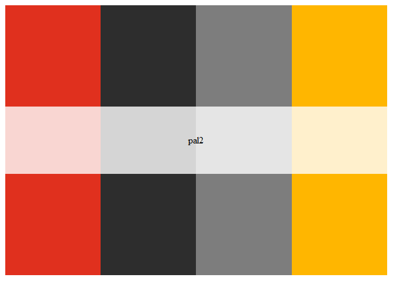

### Foreslåtte paletter

``` r
pal1 <- pwc_pal("pal1", for_print = TRUE)
pal1
```


``` r
pal2 <- pwc_pal("pal2", for_print = TRUE)
pal2
```


``` r
pal3 <- pwc_pal("pal3", for_print = TRUE)
pal3
```


``` r
pal4 <- pwc_pal("pal4", for_print = TRUE)
pal4
```


``` r
pal5 <- pwc_pal("pal5", for_print = TRUE)
pal5
```

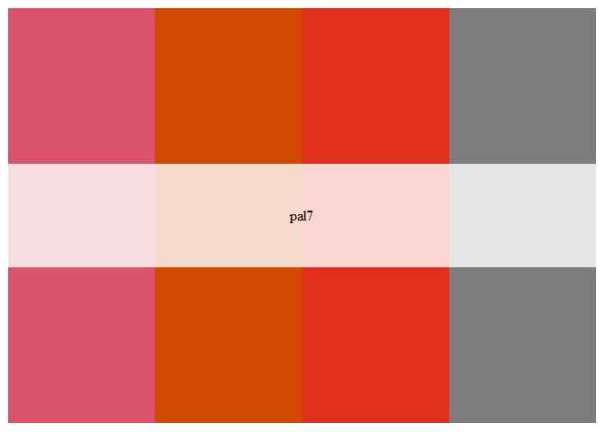

``` r
pal6 <- pwc_pal("pal6", for_print = TRUE)
pal6
```

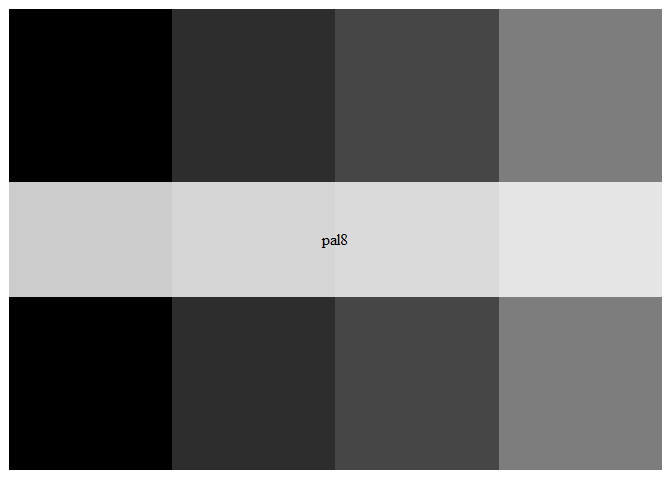

``` r
pal7 <- pwc_pal("pal7", for_print = TRUE)
pal7
```


``` r
pal8 <- pwc_pal("pal8", for_print = TRUE)
pal8
```

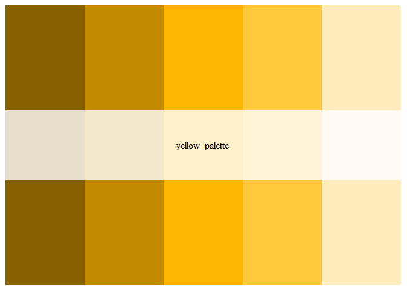

### Paletter i samme farge

``` r
orange <- pwc_pal("orange_palette", for_print = TRUE)
orange
```


``` r
# tangerine <- pwc_pal("tangerine_palette", for_print = TRUE)
# tangerine
```

``` r
yellow <- pwc_pal("yellow_palette", for_print = TRUE)
yellow
```

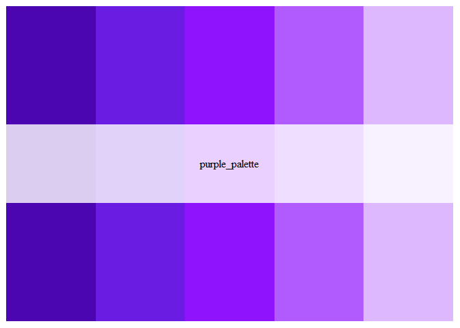

``` r
rose <- pwc_pal("rose_palette", for_print = TRUE)
rose
```

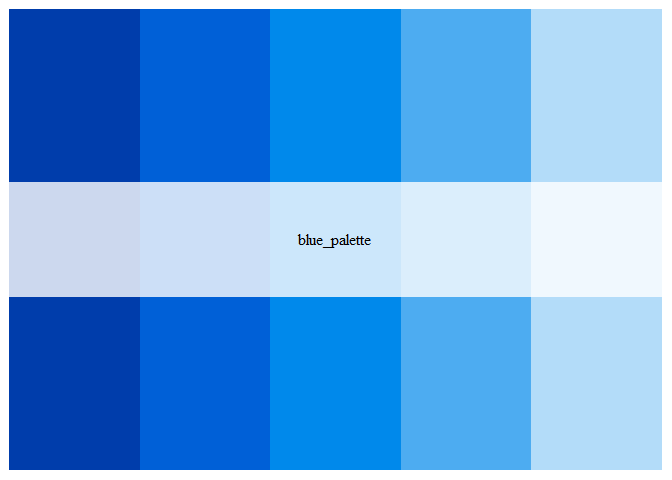

``` r
purple <- pwc_pal("purple_palette", for_print = TRUE)
purple
```

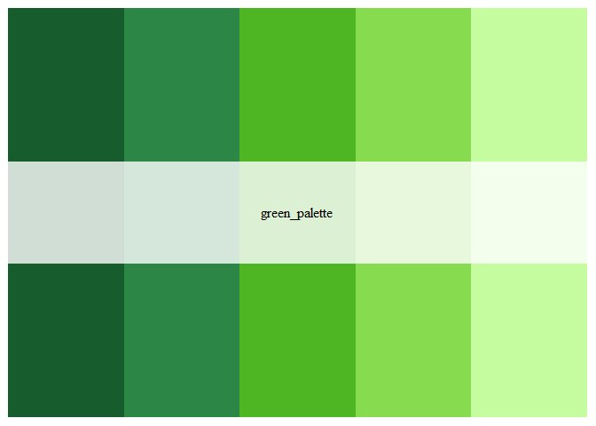

``` r
blue <- pwc_pal("blue_palette", for_print = TRUE)
blue
```


``` r
green <- pwc_pal("green_palette", for_print = TRUE)
green
```


## Logikk for valg av farger i palette

Det er lagt inn logikk, slik at dersom color/fill inneholder flere
kategorier enn farger i paletten, så konstrueres det farger basert på
gitt palette. Som retningslinje, bør man alltid benytte en palette med
nok farger for å få frem alle gruppene, men dersom det ikke går, vil
denne logikken sikre at det er mulig å produsere plott med ulike farger

#### Eksempel hvor farger skaleres

I dette tilfellet bør man velge en skala med store forskjeller mellom
fargene, ettersom skaleringsfunksjonen lager en farge ca. midt mellom
fargene til høyre og venstre

``` r
mpg %>%
  ggplot(aes(x = displ, fill = as.factor(manufacturer))) +
  geom_bar(color = "white", size = 0.25) +
  scale_fill_pwc_d(palette = "pwc_palette2_expanded", reverse = F) +
  theme(
    legend.position = "bottom",
    legend.margin = margin(t = -0.5, unit = "cm")
  ) + 
  scale_y_continuous(expand = expansion()) +
  labs(y = "Number of cars", title = "Engine displacement in liters by class of car", x = "", fill = "")
```

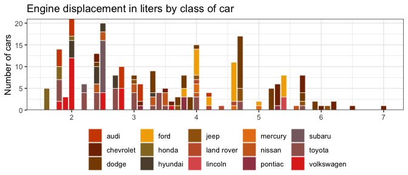
\#\#\#\# Eksempel hvor farger ikke skaleres

``` r
mpg %>%
  filter(manufacturer %in% c("audi", "chevrolet", "dodge", "ford", "honda", "hyundai", "jeep",
"land rover", "lincoln")) %>%
  ggplot(aes(x = displ, fill = as.factor(manufacturer))) +
  geom_bar(color = "white", size = 0.25) +
  scale_fill_pwc_d(palette = "pwc_palette2_expanded", reverse = F) +
  theme(
    legend.position = "bottom",
    legend.margin = margin(t = -0.5, unit = "cm")
  ) + 
  scale_y_continuous(expand = expansion()) +
  labs(y = "Number of cars", title = "Engine displacement in liters by class of car", x = "", fill = "")
```

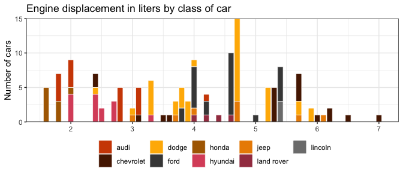
